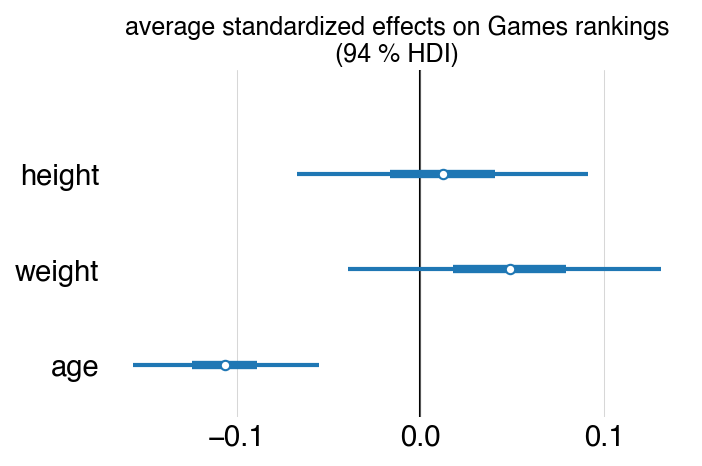

# XFT

Analyzing elite fitness competition results.

* To setup an environment and install dependencies, use [uv](https://docs.astral.sh/uv/). Install it and then run `uv sync`.
* The code has a small CLI, implemented using [typer](https://typer.tiangolo.com/), called `xft`. Just run `xft` at the command line with the environment activated to see a help menu for the commands. Or, run `uv run xft`. Some commands must be used with config files, examples of which are in the `configs/` directory. 
    * Try running `xft workout games 2015 1` to see an example.
* If downloading a lot of competition results (using `xft download <config>`), you should probably do so on cloud storage.
* Some other tools for analyzing and modeling the data and constructing Bayesian models are in the package, but not accessible via the CLI. 

A lot of analyses can be done and are done [here](https://markbaum.xyz/xft/), although that site is slightly old now. Just for show, here are marginal posterior summaries for the average effects of athlete height, weight, and age overall all Games seasons (2007-2024). Younger athletes do better, on average.

